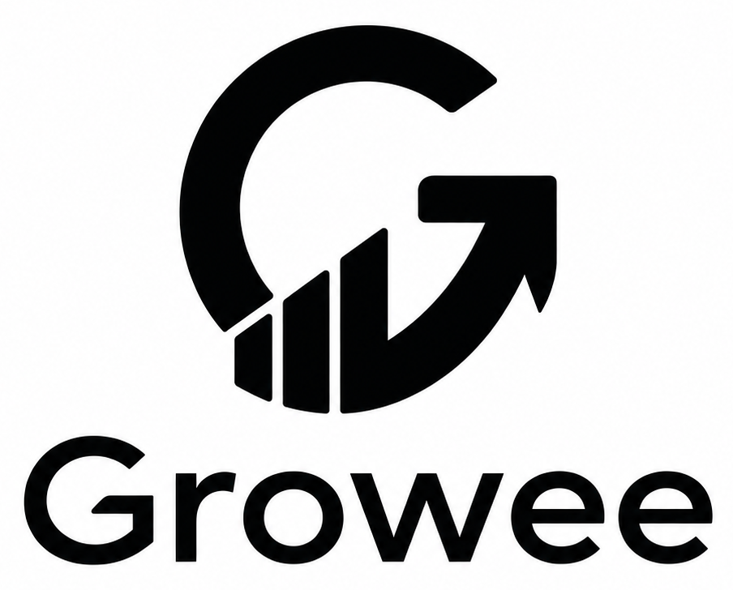

<p align="center">
  
</p>

<h1 align="center">全生命周期AI增长技能合集</h1>

<p align="center"><strong>覆盖增长诊断、内容生产、获客、激活、留存、变现及其底层增长系统的 AI 可执行能力。</strong></p>

Growee 是 [Growth Playbook（增长手册）](https://github.com/krillinai/growth-playbook)的开源执行层。增长手册解释框架、模型与证据，Growee 则把它们转化为可复用的 Agent Skills，用于边界明确的增长工作。

由企业级增长智能体产品 [clawee.ai](https://clawee.ai/) 出品。

[](https://github.com/krillinai/Growee/stargazers)
[](https://clawee.ai)
[](LICENSE)

> 由专注于内容智能与全球增长的 AI（人工智能）团队 [KrillinAI](https://github.com/KrillinAI) 创作并维护。Growth Playbook 提供方法与框架，Growee 将其转化为可复用、可由 AI 执行的工作流。

**[English](README.md) | [简体中文](README.zh-CN.md)**

## 从诊断到增长复利

Growee 与 Growth Playbook 使用同一条主线。增长诊断先识别当前约束；增长基础定义客户、市场、价值与增长模型；内容生产把战略转化为可用资产；生命周期阶段推动客户从发现产品走向首次价值、持续价值、收入和扩张；增长系统让每一阶段可测量、可重复。

```text
增长诊断
   |
   v
增长基础
   |
   v
内容生产 -> 获客 -> 激活 -> 留存 -> 变现 -> 推荐与扩张
   |
   v
测量与实验 + 增长基础设施与组织
   |
   +---- 支撑每个阶段，证据回流到下一轮增长诊断
```

| 层级 | 核心问题 | Growee 中的作用 |
| --- | --- | --- |
| 增长诊断 | 当前最主要的增长约束是什么？ | 把表面症状转化为边界明确的结果、证据台账、30 天行动与执行路径 |
| 增长基础 | 客户是谁、什么价值重要、增长应如何发生？ | 建立 PMF、ICP、定位、客户旅程、增长模型、市场与战略选择 |
| 内容生产 | 应该生产哪些有证据支撑的信息和资产？ | 规划并生产文案、图片、视频、创意、客户证据、公共关系与本地化内容 |
| 获客 | 有效需求如何发现并到达产品？ | 设计和诊断渠道、营销活动、搜索、广告、合作、社区与外联 |
| 激活 | 新用户如何到达首次价值？ | 诊断入口路径、落地体验、摩擦、新手引导与下一项关键行动 |
| 留存 | 客户如何持续获得价值？ | 分析同期群、参与度、生命周期沟通、客户健康、流失与召回 |
| 变现 | 客户价值如何转化为可持续且有利润的收入？ | 设计定价与套餐，并对账 LTV、回收期与单位经济 |
| 推荐与扩张 | 客户和产品活动如何创造更深价值与新分发？ | 构建推荐、增长循环、扩张路径、激励、多边市场与网络效应 |
| 测量与实验 | 什么发生了变化、为什么变化、结论有多可靠？ | 定义指标与追踪，保护数据质量，对账归因，进行预测并验证因果关系 |
| 增长基础设施与组织 | 企业如何让增长可以重复运行？ | 运营规划、投入、决策、复盘、学习、治理、基础设施与组织系统 |

可衡量的客户行为和业务结果会回流到下一轮诊断。真正的进展单位是这条反馈闭环，而不是内容数量或孤立的营销活动。所有 Skill 都保留证据与操作边界：外部发布和账户修改仍由用户控制，权利、声明、同意、隐私与审批必须保持明确。

## 安装与使用

`skills/` 下的每个目录都是一个可独立安装的 Agent Skill。先从增长诊断开始，再只安装与首要约束和执行路径匹配的 Skill。

```bash
git clone https://github.com/krillinai/Growee.git
mkdir -p "${CODEX_HOME:-$HOME/.codex}/skills"
cp -R Growee/skills/growth-diagnosis "${CODEX_HOME:-$HOME/.codex}/skills/"
```

当一个任务可能匹配多个能力时，建议显式调用：

```text
使用 $growth-diagnosis，识别当前最主要的增长约束，并定义下一项有证据支撑的决策。
```

明确约束后，将示例中的 `growth-diagnosis` 替换为对应 Skill 名称。对于其他兼容 Agent Skills 的客户端，将所选 `skills/<name>/` 目录复制或链接到对应的 Skill 目录即可。

<!-- BEGIN GENERATED: catalog -->
## 按增长手册主线选择能力

| 增长决策 | 建议从这里开始 |
| --- | --- |
| 识别首要增长约束，并选择最小且有证据支撑的执行路径 | [`增长诊断`](skills/growth-diagnosis/)、[`漏斗分析`](skills/funnel-analysis/)、[`增长异常调查`](skills/growth-anomaly-investigation/) |
| 定义客户、市场、匹配、定位、增长模型与战略选择 | [`产品市场匹配评估`](skills/product-market-fit-assessment/)、[`ICP（理想客户画像）与客户分群`](skills/icp-segmentation/)、[`市场定位`](skills/positioning/) |
| 把战略、客户证据与证明转化为受治理的内容和创意资产 | [`内容策略`](skills/content-strategy/)、[`文案创作`](skills/copywriting/)、[`营销视频`](skills/marketing-video/) |
| 通过渠道、营销活动、搜索、广告、合作与外联，把有效需求连接到产品 | [`获客策略`](skills/acquisition-strategy/)、[`营销活动规划`](skills/campaign-planning/)、[`SEO（搜索引擎优化）诊断`](skills/seo-audit/) |
| 推动有效访客和新用户到达首次价值与下一项关键行动 | [`激活`](skills/activation/)、[`落地页诊断`](skills/landing-page-audit/)、[`弹窗优化`](skills/popup-optimization/) |
| 维持持续价值，理解同期群与流失，并修复有价值的客户关系 | [`留存`](skills/retention/)、[`生命周期营销`](skills/lifecycle-marketing/)、[`Cohort（同期群）分析`](skills/cohort-analysis/) |
| 通过定价、套餐、LTV 与单位经济，把客户价值转化为可持续收入 | [`变现`](skills/monetization/)、[`定价与套餐策略`](skills/pricing-and-packaging-strategy/)、[`单位经济分析`](skills/unit-economics-analysis/) |
| 通过推荐、增长循环、客户扩张、多边市场与网络效应创造更深价值和新分发 | [`增长循环设计`](skills/growth-loop-design/)、[`推荐计划设计`](skills/referral-program-design/)、[`客户扩张策略`](skills/customer-expansion-strategy/) |
| 让增长可观察、可解释、可预测并可进行因果验证 | [`增长指标设计`](skills/growth-metrics-design/)、[`数据追踪方案`](skills/tracking-plan/)、[`实验设计`](skills/experiment-design/) |
| 构建规划、决策、数据、运营、治理与组织系统，让增长可以重复运行 | [`增长基础设施评估`](skills/growth-infrastructure-assessment/)、[`增长组织设计`](skills/growth-organization-design/)、[`增长经营复盘`](skills/growth-operating-review/) |

## 选择运营范围

当内容是当前约束时，使用“内容增长”组合；只有在测量、分发或运营承载能力成为限制时，才增加专业组合。

| 范围 | 说明 | 能力数量 |
| --- | --- | ---: |
| `content-growth` · 内容增长 | 把客户问题、内容生产、本地化、分发与转化连接起来的内容营销路径。 | 8 |
| `measurement-analytics` · 测量与分析 | 通过指标、追踪、归因、经济性、预测、同期群与实验，让增长可观察、可用于决策。 | 16 |
| `acquisition-distribution` · 获客与分发 | 通过渠道、营销活动、搜索、转化界面、合作、社区与外联，把有效需求连接到产品价值。 | 19 |
| `growth-operating-system` · 增长运营体系 | 通过规划、承载能力、投入、治理、复盘、学习、基础设施、组织与收入运营，把增长决策变成可重复的运行节奏。 | 17 |

## 完整增长能力图谱

<details>
<summary>按增长职能展开查看全部 Skill 与集成</summary>

**成熟度：** 预览版仍需真实任务验证；已验证版本已通过具有代表性的前向测试；稳定版已经过重复使用验证。

### 增长诊断

<table>
  <thead>
    <tr><th width="32%">技能</th><th width="12%">状态</th><th>说明</th></tr>
  </thead>
  <tbody>
    <tr><td><a href="skills/growth-diagnosis/">增长诊断</a></td><td>预览版</td><td>基于可归因证据识别首要增长约束，并为获客、激活、留存、变现、增长循环和增长系统制定兼顾市场情境的 30 天决策计划与执行路径</td></tr>
    <tr><td><a href="skills/funnel-analysis/">漏斗分析</a></td><td>预览版</td><td>冻结实体、资格、事件、分母、窗口、成熟度与 Cohort（同期群）定义，分析价值状态间的转化和绝对流失，区分观察到的掉点与原因，诊断约束并设计证据边界清晰的改进方案</td></tr>
    <tr><td><a href="skills/growth-anomaly-investigation/">增长异常调查</a></td><td>预览版</td><td>通过冻结指标契约、对账数据源、检查成熟度与预期波动、保留总量的贡献拆解、变化时间线、候选机制、因果边界与受控结论，对意外指标变化进行分流、调查和复核</td></tr>
    <tr><td><a href="skills/growth-maturity-assessment/">增长成熟度评估</a></td><td>预览版</td><td>分别核验定义、实施、运行、采用、可靠性、决策使用与结果证据，评估战略、生命周期、测量、实验、基础设施、组织、运营、风险和学习中的决策特定增长能力，避免使用通用阶段或综合评分</td></tr>
  </tbody>
</table>

### 增长基础

<table>
  <thead>
    <tr><th width="32%">技能</th><th width="12%">状态</th><th>说明</th></tr>
  </thead>
  <tbody>
    <tr><td><a href="skills/product-market-fit-assessment/">产品市场匹配评估</a></td><td>预览版</td><td>综合问题、首次价值、重复价值、Must-Have 调查、分群、经济性、分发、Four Fits 与护栏证据，对边界明确的产品市场匹配主张进行评估、测量或重新验证，不虚构通用评分或认证</td></tr>
    <tr><td><a href="skills/icp-segmentation/">ICP（理想客户画像）与客户分群</a></td><td>预览版</td><td>通过可观察规则、明确排除条件、可比的价值与经济证据、差异化路径，以及隐私和公平性控制，发现、定义、验证并治理真正改变决策的客户分群与 ICP（理想客户画像）</td></tr>
    <tr><td><a href="skills/positioning/">市场定位</a></td><td>预览版</td><td>围绕明确的购买情境、真实替代方案、能力到价值的证据链、最佳适配与排除条件、品类决策、信息架构及验证计划，构建、诊断或修订证据边界清晰的市场定位</td></tr>
    <tr><td><a href="skills/growth-model-design/">增长模型设计</a></td><td>预览版</td><td>围绕客户价值、生命周期行为、渠道、Four Fits（四种匹配）、经济性、传播、再投资、容量、护栏与决策相关约束，映射、审查、计算、版本化并进行业务特定增长模型的情景测试</td></tr>
    <tr><td><a href="skills/customer-research/">客户研究</a></td><td>预览版</td><td>规划负责任的客户研究，综合可归因的访谈、评论、问卷、支持、赢单、输单和行为证据，并将边界清晰的发现、反证与不确定性转化为可决策的客户洞察</td></tr>
    <tr><td><a href="skills/survey-design-and-analysis/">调查设计与分析</a></td><td>预览版</td><td>围绕明确决策，通过清晰的构念、目标人群、抽样框、问卷、响应状态、质量规则、缺失值、加权、不确定性和解释边界，设计、审查、本地化、投放、分析、比较并治理调查</td></tr>
    <tr><td><a href="skills/competitive-intelligence/">竞争情报</a></td><td>预览版</td><td>通过可归因来源、明确的新鲜度、产品与价格版本、能力与可用状态、客户证据、变化控制、不确定性和合乎伦理的访问边界，映射、研究、比较并监测与决策相关的替代方案</td></tr>
    <tr><td><a href="skills/customer-journey-analysis/">客户旅程分析</a></td><td>预览版</td><td>围绕参与者角色、状态路径、触点连续性、后台依赖、摩擦、失败、恢复、无障碍、退出、测量与因果边界，映射、审查并重新设计证据边界清晰的客户旅程和服务蓝图</td></tr>
    <tr><td><a href="skills/market-sizing/">市场规模估算</a></td><td>预览版</td><td>通过明确的客户与经济单元、从总需求到可实现需求的分层、兼容的自上而下与自下而上方法、来源谱系、重叠关系、可服务性、可触达性、情景、敏感性和不确定性，构建、审查并校准有证据边界的市场估算</td></tr>
    <tr><td><a href="skills/growth-strategy/">增长战略</a></td><td>预览版</td><td>审查、设计与更新以证据为边界的 6–18 个月增长选择，覆盖客户、市场、价值、机制、经济性、能力、组合、顺序、取舍、情景与复盘触发条件</td></tr>
    <tr><td><a href="skills/growth-opportunity-sizing/">增长机会测算</a></td><td>预览版</td><td>通过口径一致的基线、合格对象、变化范围、可触达性、留存价值、净经济性、时间、敏感性、重叠、承载能力、风险与决策证据，测算、审查和比较增长机会，避免虚构提升幅度或重复计算</td></tr>
    <tr><td><a href="skills/market-entry-strategy/">市场进入策略</a></td><td>预览版</td><td>通过明确的市场单元、七类准备度、滩头市场选择、本地产品与商业适配、分发、运营、数据治理、留存经济性、停止规则和退出保护，评估、比较、排序并试点新市场</td></tr>
    <tr><td><a href="skills/go-to-market-strategy/">产品市场推进策略</a></td><td>预览版</td><td>围绕客户、定位、产品方案、GTM（产品市场推进）模式与渠道路径、购买流程、首次与重复价值、交付、测量、留存经济性、准备度、试点与扩张门槛，诊断、设计、比较、排序并治理可重复的产品市场系统</td></tr>
    <tr><td><a href="skills/product-launch-strategy/">产品发布策略</a></td><td>预览版</td><td>通过明确的发布单元、准备度门槛、受众阶梯、访问与曝光状态、首次及重复价值、运营控制和基于证据的扩量决策，诊断、设计、分阶段、比较、测量并治理产品或功能发布</td></tr>
  </tbody>
</table>

### 内容生产

<table>
  <thead>
    <tr><th width="32%">技能</th><th width="12%">状态</th><th>说明</th></tr>
  </thead>
  <tbody>
    <tr><td><a href="skills/content-strategy/">内容策略</a></td><td>预览版</td><td>通过客户问题、内容角色、主题支柱、声明与证据、原生格式与渠道、产品路径、编辑流程、复用、测量、更新与退场，构建、诊断并运营证据驱动的内容组合</td></tr>
    <tr><td><a href="skills/copywriting/">文案创作</a></td><td>预览版</td><td>在明确受众、市场、语言、区域设置、渠道与声明来源的前提下，撰写页面、营销活动、产品、优惠与本地化文案</td></tr>
    <tr><td><a href="skills/copy-editing/">文案编辑</a></td><td>预览版</td><td>在不改变事实含义的前提下，审校并编辑现有文案的清晰度、信息层级、语气、声明、无障碍、行动号召及市场、区域设置与渠道适配，并记录逐项精确修改</td></tr>
    <tr><td><a href="skills/marketing-image/">营销图片</a></td><td>预览版</td><td>围绕概念谱系、产品准确性、文案、品牌、声明、素材权利、人物、平台格式、本地化、无障碍、文件 QA（质量保证）与下游学习，对真实可信的营销图片进行简报、创作、编辑、适配、诊断与治理</td></tr>
    <tr><td><a href="skills/marketing-video/">营销视频</a></td><td>预览版</td><td>围绕产品与声明准确性、源素材、人物、声音、音乐、权利、本地化、无障碍、渲染 QA（质量保证）与下游学习，对真实可信的营销视频进行简报、脚本、分镜、创作、适配、诊断与治理</td></tr>
    <tr><td><a href="skills/ad-creative/">广告创意</a></td><td>预览版</td><td>围绕可追溯的广告概念与有目的的执行变体开展调研、设计、Brief（创意简报）、诊断、比较、本地化与复盘，并明确客户证据、声明、证明、权利、版位、落地路径、无障碍、下游结果和疲劳控制</td></tr>
    <tr><td><a href="skills/public-relations/">公共关系</a></td><td>预览版</td><td>基于证据规划、撰写、诊断、本地化并治理 PR（公共关系）叙事、新闻稿、媒体材料、发言人简报与事件响应，明确管理事实、声明、引语、权利、审批、披露、纠正、报道测量和危机交接</td></tr>
    <tr><td><a href="skills/customer-proof-development/">客户证据开发</a></td><td>预览版</td><td>将可归因且获得授权的客户证据转化为可信的案例、证言、客户推荐简报、结果故事和可复用证据单元，并严格管理原话、指标、因果边界、隐私、审批、血缘、新鲜度与撤回</td></tr>
    <tr><td><a href="https://github.com/krillinai/KrillinAI">视频翻译与配音</a></td><td>集成</td><td>完成视频转写、字幕翻译、AI 配音、声音克隆及横竖屏渲染，支持多语言内容本地化。</td></tr>
  </tbody>
</table>

### 获客

<table>
  <thead>
    <tr><th width="32%">技能</th><th width="12%">状态</th><th>说明</th></tr>
  </thead>
  <tbody>
    <tr><td><a href="skills/acquisition-strategy/">获客策略</a></td><td>预览版</td><td>基于客户意图、来源到留存价值的质量、渠道与商业模式匹配、归因与增量、完整及边际经济性、饱和度、依赖关系、承载能力和市场进入证据，诊断、设计、比较、排序、扩展、限制或停止获客渠道与渠道组合</td></tr>
    <tr><td><a href="skills/campaign-planning/">营销活动规划</a></td><td>预览版</td><td>将边界明确的目标转化为基于证据的受众、定位、产品方案、渠道、旅程、资产、预算、测量、发布与复盘计划，不假设账户权限，也不直接执行活动</td></tr>
    <tr><td><a href="skills/partnership-marketing/">合作伙伴营销</a></td><td>预览版</td><td>围绕共同客户价值、双方贡献、权利、数据、归因、经济性、运营与客户保护，评估、设计、试点、治理并退出联合营销、联合销售、渠道、联盟、集成、市场和生态合作</td></tr>
    <tr><td><a href="skills/community-growth-strategy/">社区增长策略</a></td><td>预览版</td><td>通过明确的参与者角色、成员与生命周期状态、加入引导、有用互动、项目组合、贡献、治理、运营承载能力、平台韧性、产品路径、测量与信任，诊断并设计以价值为中心的社区</td></tr>
    <tr><td><a href="skills/sales-enablement/">销售赋能</a></td><td>预览版</td><td>围绕购买情境、资格判断、购买里程碑、声明、证据、替代方案、实施、价值实现与版本化一线学习，构建、诊断、本地化、治理并测量面向销售与买方的赋能资产</td></tr>
    <tr><td><a href="skills/meta-ads-audit/">Meta&nbsp;Ads&nbsp;诊断</a></td><td>预览版</td><td>在不访问或更改 Meta 实时账户的前提下，诊断用户提供的 Ads Manager CSV（逗号分隔值）、创意清单、落地页、测量证据及聚合业务结果</td></tr>
    <tr><td><a href="skills/google-ads-audit/">Google&nbsp;Ads&nbsp;诊断</a></td><td>预览版</td><td>在不访问或更改实时账户的前提下，诊断用户提供的 Google Ads 广告活动、转化、搜索、购物、Performance Max、创意、落地页、测量与聚合业务证据</td></tr>
    <tr><td><a href="skills/tiktok-ads-audit/">TikTok&nbsp;Ads&nbsp;诊断</a></td><td>预览版</td><td>在不访问或更改实时账户的前提下，诊断用户提供的 TikTok 国际广告结构、短视频创意、Spark Ads 权限、落地页、事件、归因与聚合业务证据</td></tr>
    <tr><td><a href="skills/douyin-ads-audit/">抖音广告诊断</a></td><td>预览版</td><td>在不访问实时账户的前提下，诊断用户提供的巨量引擎、巨量千川、DOU+、创意与达人权限、商品或直播电商、转化、归因及聚合业务证据</td></tr>
    <tr><td><a href="skills/seo-audit/">SEO（搜索引擎优化）诊断</a></td><td>预览版</td><td>基于可验证证据诊断技术、内容与搜索可见性问题，并提供优化建议</td></tr>
    <tr><td><a href="skills/programmatic-seo/">程序化&nbsp;SEO（搜索引擎优化）</a></td><td>预览版</td><td>围绕明确意图、可靠数据源、有用模板、页面状态、质量门槛、分批发布、下游价值、维护与退场机制，验证、设计、诊断并治理可规模化的搜索页面系统</td></tr>
    <tr><td><a href="skills/aso-audit/">ASO（应用商店优化）诊断</a></td><td>预览版</td><td>基于可验证证据诊断 App Store 与 Google Play 的可见性、商店页面、素材及转化问题，并提供优化建议</td></tr>
    <tr><td><a href="skills/geo/">GEO（生成式引擎优化）诊断</a></td><td>预览版</td><td>基于证据评估网站面向 AI（人工智能）生成式搜索的准备度，并通过边界明确的查询面板独立观测品牌提及与引用表现</td></tr>
    <tr><td><a href="skills/structured-data-builder/">结构化数据构建</a></td><td>预览版</td><td>基于页面可见内容或可归因的权威数据，生成、诊断、修复或模板化可追溯的 JSON-LD（JSON 链接数据），并提供区分产品平台和市场情境的验证与限制说明</td></tr>
    <tr><td><a href="skills/search-site-planner/">搜索站点规划</a></td><td>预览版</td><td>基于边界明确的页面或 URL（统一资源定位符）清单，规划或审查站点层级、导航、网址、面包屑、内部链接与迁移映射，并提供完整对账和市场适配验证</td></tr>
    <tr><td><a href="skills/directory-submissions/">目录提交</a></td><td>预览版</td><td>围绕实体身份、资格、分类、声明、素材、权利、验证、重复条目、付费披露、追踪、时效性与合格下游价值，筛选、准备、诊断、更新并治理准确且高价值的目录条目</td></tr>
    <tr><td><a href="skills/b2b-outbound-messaging/">B2B（企业对企业）外联沟通</a></td><td>预览版</td><td>基于可归因证据，为适配市场且已获许可的渠道起草一对一 B2B（企业对企业）消息、边界明确的序列、跟进与原生本地化内容，并明确权限、停止状态、隐私和外部操作边界</td></tr>
    <tr><td><a href="https://github.com/krillinai/autosocial-skills">社交媒体自动发布</a></td><td>集成</td><td>使用可复用的标题、描述、标签和元数据，将视频自动发布到小红书、抖音、快手和微信视频号。</td></tr>
  </tbody>
</table>

### 激活

<table>
  <thead>
    <tr><th width="32%">技能</th><th width="12%">状态</th><th>说明</th></tr>
  </thead>
  <tbody>
    <tr><td><a href="skills/activation/">激活</a></td><td>预览版</td><td>基于证据定义并分析第一价值，诊断新手引导与激活路径约束，设计适用于不同入口状态、产品层级及消费级、B2B（企业对企业）、平台型、AI（人工智能）、低频或人工辅助产品的激活干预</td></tr>
    <tr><td><a href="skills/landing-page-audit/">落地页诊断</a></td><td>预览版</td><td>通过固定六维评分与独立证据覆盖率，诊断来源到页面的信息连续性、价值、证据、层级、CTA（行动号召）、表单、摩擦、移动体验、无障碍、下游质量与测量准备度</td></tr>
    <tr><td><a href="skills/popup-optimization/">弹窗优化</a></td><td>预览版</td><td>通过明确的相关性、资格、触发、频率、抑制、同意、关闭、无障碍、移动端、性能、下游价值与护栏，设计、诊断、本地化并实验尊重用户的弹窗、模态框、横幅、滑入层和插屏体验</td></tr>
  </tbody>
</table>

### 留存

<table>
  <thead>
    <tr><th width="32%">技能</th><th width="12%">状态</th><th>说明</th></tr>
  </thead>
  <tbody>
    <tr><td><a href="skills/retention/">留存</a></td><td>预览版</td><td>基于证据定义并分析同期群留存，诊断持续价值、流失与复活机制，设计覆盖用户、账户、产品和收入层级的留存体系</td></tr>
    <tr><td><a href="skills/cohort-analysis/">Cohort（同期群）分析</a></td><td>预览版</td><td>定义基于时间、曝光、行为或状态的 Cohort（同期群），使用用户提供的事件或汇总数据构建考虑成熟度的矩阵，比较兼容群体，并在不虚构因果结论的前提下区分 Mix 变化与 Cohort（同期群）内部变化</td></tr>
    <tr><td><a href="skills/growth-accounting/">增长核算</a></td><td>预览版</td><td>通过明确的实体、身份、成熟度、价值口径、调整项、组合与因果边界，将周期之间的客户和经常性价值变化对账为留存、新增、复活、流失、扩张与收缩</td></tr>
    <tr><td><a href="skills/engagement-analysis/">参与度分析</a></td><td>预览版</td><td>围绕自然使用机会和产品结构，分析包含零值人群的价值行为频率、深度、广度、质量与集中度分布，避免把活动量当作留存、产品市场匹配、因果关系或业务影响</td></tr>
    <tr><td><a href="skills/lifecycle-marketing/">生命周期营销</a></td><td>预览版</td><td>在明确消息分类、渠道许可、抑制状态与外部操作边界的前提下，规划、撰写、审校和本地化覆盖欢迎、激活、事务服务、留存、召回与活动推广的邮件、短信、微信公众号、小程序订阅消息、企业微信和 WhatsApp 沟通</td></tr>
    <tr><td><a href="skills/customer-health-modeling/">客户健康建模</a></td><td>预览版</td><td>围绕明确的客户层级、结果、预测时点、特征、标签、删失、信息泄漏、校准、服务容量阈值、原因代码、漂移、隐私与安全行动边界，对面向具体决策的客户及账户健康模型进行规范、构建、审查、验证、校准、监测与更新</td></tr>
  </tbody>
</table>

### 变现

<table>
  <thead>
    <tr><th width="32%">技能</th><th width="12%">状态</th><th>说明</th></tr>
  </thead>
  <tbody>
    <tr><td><a href="skills/monetization/">变现</a></td><td>预览版</td><td>梳理用户、购买者与付款人的价值关系，分析产品方案、包装、定价、付费转化、留存收入和单位经济性，并设计兼顾迁移、公平性与市场条件的商业体系</td></tr>
    <tr><td><a href="skills/pricing-and-packaging-strategy/">定价与套餐策略</a></td><td>预览版</td><td>围绕客户价值与购买角色，诊断、研究、设计、验证、迁移并治理产品方案、套餐架构、计价指标、价格与条款、折扣、免费与试用路径、留存经济性、实验和客户保护</td></tr>
    <tr><td><a href="skills/unit-economics-analysis/">单位经济分析</a></td><td>预览版</td><td>围绕 CAC（客户获取成本）的不同口径、匹配 Cohort（同期群）的贡献与 LTV（客户终身价值）、会计与现金回收期、边际回报、免费增值与双边市场经济、组合结构、情景、不确定性和决策边界，进行诊断、建模、比较与治理</td></tr>
    <tr><td><a href="skills/ltv-analysis/">LTV（客户终身价值）分析</a></td><td>预览版</td><td>通过明确的客户实体、Cohort（同期群）、原始分母、价值与成本口径、成熟度、删失、时间范围、模型假设、不确定性、校准与决策边界，诊断、计算、预测、比较、验证并治理客户终身价值</td></tr>
  </tbody>
</table>

### 推荐与扩张

<table>
  <thead>
    <tr><th width="32%">技能</th><th width="12%">状态</th><th>说明</th></tr>
  </thead>
  <tbody>
    <tr><td><a href="skills/referral-program-design/">推荐计划设计</a></td><td>预览版</td><td>围绕推荐人和接收人价值、触发时机、权限、落地连续性、奖励、身份、留存质量、增量性、经济性、反作弊、信任与运营，设计、诊断、测量并治理推荐计划</td></tr>
    <tr><td><a href="skills/growth-loop-design/">增长循环设计</a></td><td>预览版</td><td>诊断增长机制是否真正闭合，衡量创造价值的关键转化，并在不执行外部操作的前提下，设计证据边界清晰的协作、推荐、内容、市场、数据或再投资循环</td></tr>
    <tr><td><a href="skills/network-effects-strategy/">网络效应策略</a></td><td>预览版</td><td>基于边界明确的网络单元、参与者价值、核心交互、难侧、本地流动性、质量、留存、多归属、拥堵、防御性、因果证据与市场特定的毕业门槛，诊断、冷启动、强化、复制、治理或停止网络效应策略</td></tr>
    <tr><td><a href="skills/customer-expansion-strategy/">客户扩张策略</a></td><td>预览版</td><td>围绕活跃席位、使用深度、工作流、产品、团队、产品合格扩张信号、采用与商业结果对账、留存贡献和客户保护，审计、设计、排序、测量并治理既有客户关系内的价值扩张</td></tr>
    <tr><td><a href="skills/marketplace-growth-strategy/">Marketplace（多边市场）增长策略</a></td><td>预览版</td><td>围绕原子市场单元、各参与方状态路径、本地流动性、匹配、履约、质量、留存、激励、参与者与平台经济性、信任及证据门槛，诊断、冷启动、优化、复制、治理或停止双边与多边市场增长</td></tr>
    <tr><td><a href="skills/incentive-system-design/">激励系统设计</a></td><td>预览版</td><td>基于留存增量贡献、完整成本、激励后行为、欺诈、蚕食、公平与信任，诊断、设计、递减或停止奖励、折扣、额度、补贴、推荐、忠诚度、进度、身份与结构性激励</td></tr>
  </tbody>
</table>

### 测量与实验

<table>
  <thead>
    <tr><th width="32%">技能</th><th width="12%">状态</th><th>说明</th></tr>
  </thead>
  <tbody>
    <tr><td><a href="skills/growth-metrics-design/">增长指标设计</a></td><td>预览版</td><td>审查 KPI（关键绩效指标）与北极星指标候选，设计连接客户价值的指标组合和标注证据关系的指标树，并在不虚构基准或因果关系的前提下，定义可复现的指标契约、护栏、目标、血缘、质量与治理机制</td></tr>
    <tr><td><a href="skills/growth-target-setting/">增长目标设定</a></td><td>预览版</td><td>基于版本化指标、基线、预测、机会、层级、承载能力、取舍、激励、归属和复盘规则，审查、设计、对账并更新增长结果目标、输入承诺、阈值、愿景目标与护栏</td></tr>
    <tr><td><a href="skills/growth-benchmark-analysis/">增长基准分析</a></td><td>预览版</td><td>通过明确的参考群体、指标可比性、来源谱系、偏差、成熟度、不确定性和迁移边界，搜集、审查、归一化、比较并监测内部、同行、行业、供应商、调查、模型与案例基准</td></tr>
    <tr><td><a href="skills/tracking-plan/">数据追踪方案</a></td><td>预览版</td><td>通过明确的价值状态、事实来源、身份、同意、血缘、对账、QA（质量保证）、发布、回滚与废弃控制，设计、诊断或迁移可直接实施的事件与属性规范</td></tr>
    <tr><td><a href="skills/growth-data-quality-audit/">增长数据质量审计</a></td><td>预览版</td><td>围绕总体覆盖、完整性、身份、唯一性、语义有效性、时效、成熟度、血缘、跨源对账、历史修订、质量事故、监控、隐私与治理，审查决策关键型增长数据并设计质量控制</td></tr>
    <tr><td><a href="skills/attribution-analysis/">归因分析</a></td><td>预览版</td><td>通过明确的结果、身份、来源、旅程、触点、回溯窗口、模型、未知状态、下游价值、收入、质量、隐私与增量边界，诊断、设计、比较并对账归因体系</td></tr>
    <tr><td><a href="skills/marketing-mix-modeling/">营销组合建模</a></td><td>预览版</td><td>围绕已对账结果、媒体与环境面板、Adstock（广告滞后效应）、饱和度、可识别性、实验、验证、贡献、响应支持范围、不确定性及决策边界明确的预算情景，对 MMM（营销组合模型）进行规范、构建、审查、校准、比较与更新</td></tr>
    <tr><td><a href="skills/growth-forecasting/">增长预测</a></td><td>预览版</td><td>通过明确的截至时间快照、实际与预测区间、驱动因素、假设、方法、不确定性、修订、偏差与市场边界，构建、诊断、比较、回测、校准、版本化并治理可用于决策的增长预测</td></tr>
    <tr><td><a href="skills/experiment-design/">实验设计</a></td><td>预览版</td><td>判断何时适合实验，设计或审查可信的因果及替代证据方案，并通过明确的分配、曝光、指标、功效、SRM（样本比例失配）、干扰、护栏和决策规则解读成熟结果</td></tr>
  </tbody>
</table>

### 增长基础设施与组织

<table>
  <thead>
    <tr><th width="32%">技能</th><th width="12%">状态</th><th>说明</th></tr>
  </thead>
  <tbody>
    <tr><td><a href="skills/growth-planning-cycle/">增长规划周期</a></td><td>预览版</td><td>通过对齐战略、指标、目标、预测、机会、投资、组合、项目、承载能力、预算边界、决策日历、审批与经营复盘，构建、审查并更新一致的年度、季度或滚动增长规划周期</td></tr>
    <tr><td><a href="skills/growth-capacity-planning/">增长承载能力规划</a></td><td>预览版</td><td>围绕需求、工作量、人员、技能、系统、供应商、库存、客户与实验曝光、队列、吞吐量、服务、共享约束、利用率、储备、情景、触发条件及待审批缺口方案，构建、审查并更新证据边界清晰的承载能力计划</td></tr>
    <tr><td><a href="skills/growth-investment-case/">增长投资决策案</a></td><td>预览版</td><td>通过明确的基线、备选方案、客户价值、证据、增量收益与成本、现金、承载能力、风险、情景、决策门槛和审批边界，审查、构建并更新可用于决策的单项增长投资论证</td></tr>
    <tr><td><a href="skills/growth-budget-allocation/">增长预算与资源配置</a></td><td>预览版</td><td>通过核对可用资源、保护必要投入，并比较客户价值、增量与边际经济性、现金、承载能力、重叠、情景、证据门槛和审批边界，审查、设计和重新配置跨职能增长预算与资源</td></tr>
    <tr><td><a href="skills/growth-initiative-planning/">增长项目规划</a></td><td>预览版</td><td>围绕一个已选定的增长项目，通过决策谱系、明确结果、工作流、依赖关系、承载能力、证据门槛、承诺、风险、变更规则与授权边界，构建、审查并重新规划可执行的 30–90 天计划</td></tr>
    <tr><td><a href="skills/growth-operating-review/">增长经营复盘</a></td><td>预览版</td><td>构建、审查和更新以决策为中心的周度、月度或季度增长复盘，核对客户价值、生命周期、增长核算、经济性、预测、异常、实验、项目组合、风险、决策与承诺，避免把状态当成业务影响</td></tr>
    <tr><td><a href="skills/growth-decision-record/">增长决策记录</a></td><td>预览版</td><td>围绕一项增长决策构建、审查和更新唯一、可版本化的规范记录，保留备选方案、证据、假设、不确定性、异议、权限、条件、依赖、下游使用方、后续行动、结果、纠正、到期与替代关系，避免改写历史或暗示已经执行</td></tr>
    <tr><td><a href="skills/growth-risk-management/">增长风险管理</a></td><td>预览版</td><td>围绕跨项目增长风险组合进行构建、审查与更新，明确风险状态、证据、风险偏好、容忍度、限额、相互作用、集中度、控制、处置、接受、监测、升级、关闭与剩余义务，避免虚构评分或替代专业判断</td></tr>
    <tr><td><a href="skills/growth-learning-system/">增长学习系统</a></td><td>预览版</td><td>通过来源谱系、有边界的学习单元、上下文、矛盾、去重、检索、新鲜度、使用权、复用、决策关联、纠正与退场，构建、审查和更新可复用的增长学习库，避免把摘要、引用或使用量当成事实与影响</td></tr>
    <tr><td><a href="skills/growth-change-management/">增长变更管理</a></td><td>预览版</td><td>围绕已授权增长变更的受影响人群、准备度、承载能力、沟通、赋能、支持、迁移、发布、采用、稳定运行、旧流程退场与结果证据，构建、审查和更新边界明确的过渡体系，避免把公告、培训、权限开通或上线当成影响</td></tr>
    <tr><td><a href="skills/growth-postmortem/">增长专项复盘</a></td><td>预览版</td><td>为已完成、停止、造成伤害或无结论的增长工作构建、审查和更新证据边界清晰的专项复盘，保留原始决策，核对结果与经济性，约束因果主张，区分决策质量和结果质量，并把发现转化为受治理的学习与后续行动</td></tr>
    <tr><td><a href="skills/growth-infrastructure-assessment/">增长基础设施评估</a></td><td>预览版</td><td>评估数据、指标、实验、决策、执行、创意与治理能力，判断哪些能力适合中心化或应保留本地决策，对比自建、采购、组合、整合或退役方案，并制定按依赖关系排序的基础设施路线图</td></tr>
    <tr><td><a href="skills/growth-organization-design/">增长组织设计</a></td><td>预览版</td><td>围绕当前约束诊断并设计结果归属、决策权、中心与嵌入边界、人员配置情景、项目组合、运行节奏、长期维护、组织健康与基于证据的重组触发条件</td></tr>
    <tr><td><a href="skills/revops-audit/">RevOps（收入运营）诊断</a></td><td>预览版</td><td>诊断收入实体、生命周期定义、买方进展、路由、归属、交接、系统、销售管道、预测、商业与财务对账、客户价值、续约、扩张及控制，并制定按依赖关系排序的修复路线图</td></tr>
    <tr><td><a href="skills/experiment-program-management/">实验项目管理</a></td><td>预览版</td><td>通过以决策为中心的准入、组合选择、流量与承载能力、并发控制、实验前门槛、质量事故、成熟度、决策跟进、长期验证、学习复用与治理，审查、设计和更新跨团队实验项目</td></tr>
  </tbody>
</table>

</details>
<!-- END GENERATED: catalog -->

## 增长原则

- 先诊断当前约束，再选择渠道、战术或工具。
- 在扩大生命周期动作之前，先建立客户、市场、匹配、定位与增长模型。
- 把内容生产视为执行层，并确保它连接到有效获客和客户价值。
- 把获客、激活、留存、变现、推荐与扩张作为同一个生命周期系统管理。
- 用指标、实验、基础设施和组织支撑每个阶段，并把证据带回下一轮诊断。

## 参与贡献

Growee 遵循 [Growth Playbook（增长手册）](https://github.com/krillinai/growth-playbook)的结构与证据标准。只有在现有能力无法覆盖一项明确、可复用的增长决策时，才新增 Skill。贡献内容应定义其所属手册层级、证据输入、可执行工作流、可检查输出、测量路径和操作边界。

## 许可证

本项目采用 [MIT 许可证](LICENSE) 开源。
